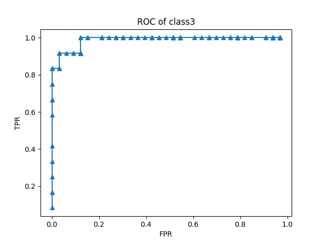
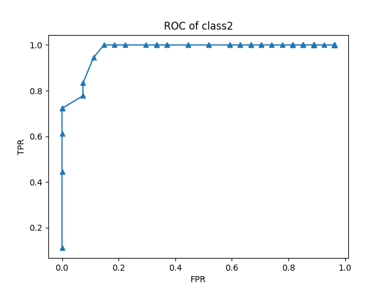
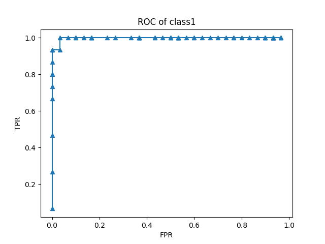

# ML004 朴素贝叶斯分类

[TOC]

## 1. 问题描述

1.  对训练集划分出训练数据和测试数据， 使用朴素贝叶斯分类， 得到准确分类数据
2.  使用测试数据评估模型， 得到混淆矩阵， 精准率， 召回率， F factor
3. 画出AUC曲线， 找出最佳分类阈值

### 1.1 数据描述

这是一份酒庄的数据， 尝试使用13个特征描述标签。

* 一共有1-3三种标签， 数量分别是
  * class 1 59 
  * class 2 71 
  * class 3 48
* 特征向量有十三维， 每一个分量都是连续的
* 每一行， 第一个分量是class， 其他是标签

## 2. 解决方法

### 2.1 解决思路


### 2.2 基本理论

#### 2.2.1 朴素贝叶斯理论

朴素贝叶斯分类是基于贝叶斯定理和特征条件独立假设的分类方法。 对于给定的训练数据集， 首先基于特征条件独立假设学习输入/输出的联合概率分布。基于此， 对于给定的输入x,利用贝叶斯定理求出后验概率最大的输出y

##### 2.2.1.1 贝叶斯定理

设特征空间为n纬度向量的集和。 输出空间为一维。 X是一个特征向量， Y为一个分类标签。
$$
P(Y=c_k|X=x) = \frac{P(X=x|Y=c_k)\times P(Y=c_k)}{P(X=x)} \tag1
$$


该定理其实基于条件概率， 即
$$
P(X=x|Y=c_k) \times P(Y=c_k) = P(X=x\&Y=c_k) = P(Y=c_k|X=x) \times P(X=x)  \tag{2}
$$

##### 2.2.1.2 独立同分布假设

独立同分布假设， 假设的是X作为一个n维的特征向量， 每一个分量之间独立同分布， 即， 
$$
P(X=x|Y=c_k) = \prod_{j=1}^nP(X^{(j)}=x^{(j)}|Y=c_k) \tag3
$$
这是一个强假设， 保证了模型的简单， 但是模型的泛化能力不算特别强， 很多时候就是因为这个假设不能完全满足。 

##### 2.1.1.3 后验概率最大化的含义

当我们使用贝叶斯估计的时候， 我们最终的目的计算后验概率， 即， Y的每一个值， 计算
$$
P(Y=c_k|X=x)   \space \space    k = 1, 2, 3, ……… \tag4
$$
使后验概率最大的ck就是我们预测的Y的值。

为什么要后验概率最大化呢？ 实际上这等价于**期望风险最小化**。

#### 2.2.2 评估标准

##### 2.2.2.1 混淆矩阵

| 真实  | 预测     |          |
| ----- | -------- | -------- |
|       | Positive | Negative |
| True  | TP       | FN       |
| False | FP       | TN       |

##### 2.2.2.2 精准率 precision

$$
Precision = \frac{TP}{TP + FP} \tag5
$$

反映的是， 在所有预测结果里有多少预测对了。

##### 2.2.2.3 召回率 recall

$$
recall = \frac{TP}{TP+FN} \tag6
$$

反映的是， 真实中正确的例子有多少被找了出来

##### 2.2.2.4 F factor 

precision和recall是一对矛盾的变量， 一般而言， precision高的时候， recall下降。 recall高的时候， precision下降。 当我们想要兼顾两者的时候， 使用F度量 ， 公式
$$
F_\beta = \frac{(1+\beta^2)PR}{(\beta^2P)+R} \tag7
$$
常见的情况是使用β=1的度量， 即F1度量
$$
F1 = \frac{2PR}{P+R} = \frac{2\times TP}{N + TP - TN} \tag8
$$

##### 2.2.2.5 ROC和AUC

ROC曲线：

定义：
$$
TPR = \frac{TP}{TP + FN} \tag{9}
$$

$$
FPR = \frac{FP}{TN+FP} \tag{10}
$$

ROC曲线是以以FPR为横轴， 以TPR为纵轴的曲线

ROC全称受试者工作曲线（Receiver Operating Characteristic）。

 

AUC：(Area Under Roc Curve)

AUC是ROC图曲线围成的面积， 可以如下近似计算
$$
AUC = \sum_{i=1}^{m-1} (x_{i+1} - x_i)(y_i + y_{i+1}) \tag{11}
$$

##### 2.2.2.6 代价敏感错误率

我们之前总是假设错误的代价权重和正确的相同， 即
$$
err\_rate = err\_count \div total \tag{12}
$$
但是这是有问题的， 有些问题中，一次错误判断可能有很高的代价， 比如误诊。 所以我们可以设置一个"非均等代价"(unequal cost)

### 2.3 算法分析

#### 2.3.1 朴素贝叶斯实现

根据公式1， 


$$
P(Y=c_k|X=x) = \frac{P(X=x|Y=c_k)\times P(Y=c_k)}{P(X=x)} \tag1
$$

* 计算P(X=x)

我们需要对每一个标签ck， 计算条件概率， 那么我们就需要计算等式右边的三个变量。 

又依据独立同分布假设， （公式2）， 我们将特征向量里的每一个分量xi，都假设它是服从一维高斯分布， 根据极大似然估计的方法估计出P（Xi = xi),  然后依据公式2乘起来。

值得一提的是， **在我们做预测的时候， 对于一个特性向量x, P（X=x) 的值是恒定的， 不会成为我们预测的标准， 所以可以不计算。**

* 计算P(Y=ck)

直接使用频率估计概率就行

* 计算P(X=x|Y=ck)

先在样本中提取出Y=ck的样本， 然后在新的样本里计算P(X=x)。

实际计算的时候， 为了**避免过多浮点数做乘法细节丢失**， 可以计算
$$
P = log [P(X=x|Y=c_k)\times P(Y=c_k)] \\ = \sum_{j=1}^nlog[P(X^{(j)}=x^{(j)}|Y=c_k)] + log  P(Y=c_k) \tag{13}
$$
由于log函数在定义域上**单调递增**， P的相对大学可以代表公式1的相对大小

具体代码如下


```python
class Bayes:
    def __init__(self, X, Y):
        self.mu_list = []
        self.sq_sigma_list = []
        self.X = X
        self.Y = Y
        (row, col) = X.shape
        for i in range(col):
            x_i = X[:, i]
            self.mu_list.append(cal_m(x_i))
            self.sq_sigma_list.append(cal_cov(x_i, x_i))

    def cal_p_Yey(self, y):
        """cal P(Y=y)"""
        a = np.sum(self.Y == y) / self.Y.shape[0]
        return np.log(a)

    def cal_p_Xex(self, x):
        """cal P(X=x) x is an array"""
        P_list = []
        for i in range(len(x)):
            P_list.append(cal_gaussian_P(x[i], self.mu_list[i], self.sq_sigma_list[i]))
        P_list = np.log(P_list)
        return np.sum(P_list)


def cal_p_Xx_when_Yy(X, x, Y, y):

    """cal P(X=x|Y=y) """
    y_index = np.where(Y == y, Y, 0).nonzero()
    n_m = Bayes(X[y_index], Y[y_index])
    return n_m.cal_p_Xex(x)


def cal_p_Yy_when_Xx(X, x, Y, y):
    """cal P(Y=y|X=x)"""
    P_Xx_when_Yy = cal_p_Xx_when_Yy(X, x, Y, y)
    ba = Bayes(X, Y)
    P_Yy = ba.cal_p_Yey(y)
    # P_Xx = ba.cal_p_Xex(x)
    return P_Xx_when_Yy + P_Yy
```

#### 2.3.2 ROC 和 AUC 计算

~~~python
    cla = 3

    threadH = []

    for x in X_test:
        p = cal_p_Yy_when_Xx(X_train, x, Y_train, cla)
        threadH.append(p)

    Y_test_u = np.where(Y_test == cla, True, False)
    FPRs = []
    TPRs = []
    mi = int(np.min(threadH))
    ma = int(np.max(threadH))
    step = int((ma - mi) / 10)
    for t in range(mi, ma, 1):
        th = t
        Y_predicted = []
        for x in X_test:
            p = predict_threshold(X_train, x, Y_train, cla, th)
            Y_predicted.append(p)
        # CM
        CM = np.zeros((2, 2))
        for i in range(len(Y_test_u)):
            T = Y_test_u[i]
            P = Y_predicted[i]
            if T:
                if P:
                    CM[0, 0] += 1
                else:
                    CM[0, 1] += 1
            else:
                if P:
                    CM[1, 0] += 1
                else:
                    CM[1, 1] += 1
        TPR = CM[0, 0] / (CM[0, 0] + CM[0, 1])
        FPR = CM[1, 0] / (CM[1, 1] + CM[1, 0])

        TPRs.append(TPR)
        FPRs.append(FPR)

    # print(FPRs)
    # print(TPRs)
    plt.plot(FPRs, TPRs, '^-')
    plt.title("ROC of class" + str(cla))
    plt.xlabel("FPR")
    plt.ylabel("TPR")
    # plt.show()
    plt.savefig("ROC of class" + str(cla) + ".png")
    index_AUC = np.argsort(FPRs)

    print(cal_AUC(np.array(FPRs)[index_AUC], np.array(TPRs)[index_AUC]))
~~~


## 3. 实验分析

### 3.1 混淆矩阵 

~~~
Confusion_Matrix of class 1
[[ 15.   0.]
 [  0.  30.]]
Confusion_Matrix of class 2
[[ 18.   0.]
 [  0.  27.]]
Confusion_Matrix of class 3
[[ 12.   0.]
 [  0.  33.]]
~~~

如果所有预测都对（即err=0）的话，混淆矩阵就是对角阵

### 3.2 precision && recall && F1 factor

依据公式5， precision=1

依据公式6，recall = 1

**数据集太小的话就会出现这种预测全中的情况， 这种情况下调参是无从谈起的。** 反正都百分百正确率率了嘛。一般而言， precision 和 recall 是一对此消彼长的矛盾量， 很多时候需要依据不同的具体背景去确定模型需要高precision或者高recall， 比如说， 

* 关注“推荐给用户的信息中用户喜欢多少” ， 那应该选择高recall
* 关注“乙肝患者中有多少能被初步筛选出来”， 那应该选择高precision

但如果你是一个“**我全都要**” 的成年人， 想要在高recall 和 高precision兼顾的话， 那可以使用 F1 factor， 根据公式8，现在F1 factor = 1， 调参分析的时候也是 F1 factor 越大模型越好。  

### 3.3 ROC 和 AUC

#### class = 3 

AUC = 0.953282828283




#### class = 2



AUC = 0.939300411523

#### class = 1



AUC = 0.962222222222

AUC反应的是ROC曲线围成的面积， 这是调参的时候的一种不得已的评估方法。 

同一个问题， 假设模型A的ROC曲线能完全包住模型B的， 那么我们可以认为模型A完全优于模型B， 但是这种情况是很少有的， 一般是 ROC 曲线相交。 在这种情况下， 只能比较ROC曲线下的面积， 也就是AUC。由于我们的预测方法实际上是计算三个类的条件概率， 选条件概率最大的类， ROC曲线和AUC则必须基于二分类问题计算， 所以ROC和AUC其实不太能指导我们的算法调参。