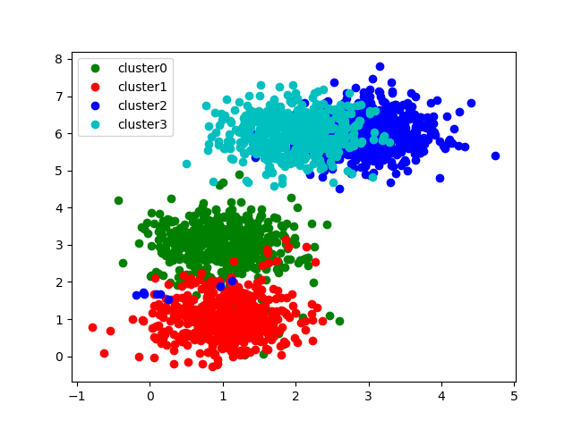
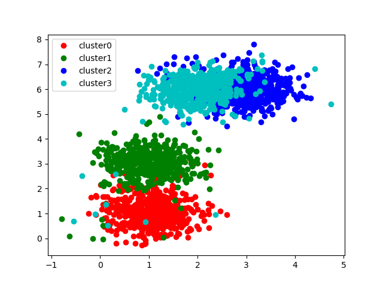
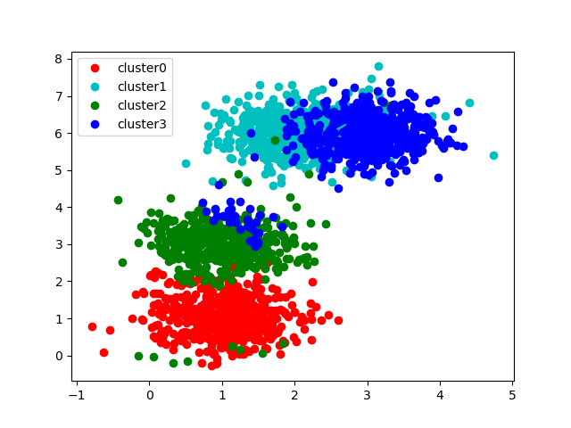

# ML 005 聚类

[TOC]

## 1. 问题描述

### 1.1 数据生成

本次的数据是以指定的三维点为均值点， 依据**高斯分布**生成的。 按照实验报告要求， 生成2000个sample。

取前两个维度作图， 有

### 1.2 要求层次

* 基本要求
  * 实现single-linkage层次聚类算法
  * 实现complete-linkage层次聚类算法
* 中级要求
  * 实现average-linkage层次聚类算法
* 高级要求
  * 对比上述三种算法，给出你的结论。
  * 通过变换聚类簇的个数，测试上述三种算法的性能，并给出你的分析；

## 2. 解决方法

聚类是机器学习“新算法”出现最快的领域， 其一大原因是聚类是无监督的。 即聚类不存在客观的标签作为标准， 而是尝试从数据中发现某种模式。 聚类算法的核心是两点：

* 距离定义
* 聚合方法

因为无监督， 聚类算法的评价标准也不像分类一样清晰明确， 根据我的查询， 聚类算法的评估方式大致有

* 霍普金斯统计

* 聚类质量

我们这次评价聚类， 会使用分类的思路。计算混淆矩阵， 计算precision 、 recall 、 F1 factor。 但这是因为我们的数据是生成的。 我们其实是有标签的。 

### 2.1 距离定义

#### 2.1.1 Item 间距离定义

每个Item实际上是一个特征向量， 说到底是特征向量之间的距离定义。 老生常谈。 我们仅简单列出， 不再赘述实现。 

* Minkowski distance
  * k = 1 Manhattan distance
  * k = 2 Euclidean distence
* 向量夹角距离

#### 2.1.2 cluster 间距离定义

##### 2.1.2.1    Single-linkage clustering

一个类的所有成员到另一个类的所有成员之间的**最短**两点之间的距离

具体到代码是这样

~~~python
def single_linkage_distence(one_cluster, other_cluster):
    T = []
    # 传入两个 cluster 类对象， 对象成员变量point_list表示这个cluster的piont_list
    for item_a in one_cluster.point_list:
        for item_b in other_cluster.point_list:
            #  distence_matrix 是类的成员变量， 保持了所有item之间的距离
            T.append(one_cluster.distence_matrix[item_a, item_b])
    return np.min(T)
~~~

##### 2.1.2.1    Complete-linkage clustering

两个类中**最远**的两个点之间的距离， 和 Single-linkage clustering 只是最后取哪个值有区别。 

~~~python
def complete_linkage_distence(one_cluster, other_cluster):
    T = []
    for item_a in one_cluster.point_list:
        for item_b in other_cluster.point_list:
            T.append(one_cluster.distence_matrix[item_a, item_b])
    return np.max(T)
~~~

##### 2.1.2.2     Average-linkage clustering

两个类中的点两两的距离求**平均**， 同， 仅有细微区别(return 平均值)

~~~python
def average_linkage_distence(one_cluster, other_cluster):
    T = []
    for item_a in one_cluster.point_list:
        for item_b in other_cluster.point_list:
            T.append(one_cluster.distence_matrix[item_a, item_b])
    return np.mean(T)
~~~

### 2.2 聚合方法

#### 2.2.1 层次聚类

层次聚类试图在不同层次上对类做出聚合。 我实现的聚类是自底向上的。 

~~~python
def hierarchical_clustering(itemlist, item_dis_mat, dis_func, num):
    """item_dis_mat[i,j] is distence of item i and j"""
		
    
    # 初始化， 每一个item是一个cluster
    clusterlist = []
    for item in itemlist:
        n_clu = my_cluster(item_dis_mat)
        n_clu.point_list.append(item)
        clusterlist.append(n_clu)

    # 循环条件， 类的数目大于num
    while len(clusterlist) > num:
        # 初始化cluster距离矩阵
        cluster_dis_mat = np.zeros((len(clusterlist), len(clusterlist)))
        for i in range(len(clusterlist)):
            for j in range(i, len(clusterlist)):
                # 这里 dis_fun 是传入的函数， 就是上一节的三种不同的cluster之间距离度量
                cluster_dis_mat[i, j] = dis_func(clusterlist[i], clusterlist[j])
                cluster_dis_mat[j, i] = float('inf')
				# 记录现有 cluster
        all_clu_set = set(range(len(clusterlist)))
        # 记录合并过的 cluster
        used_clu_set = set([])

        merged_cluster = []
        while all_clu_set != used_clu_set:
            # 处理奇数个类
            if len(all_clu_set) % 2 == 1 and len(all_clu_set) - len(used_clu_set) == 1:
                l = list(all_clu_set - used_clu_set)[0]
                merged_cluster.append(clusterlist[l])
                break

            # 加速 只剩 两个 情况
            if len(all_clu_set) - len(used_clu_set) == 2:
                l = list(all_clu_set - used_clu_set)
                for item in clusterlist[l[0]].point_list:
                    clusterlist[l[1]].point_list.append(item)
                merged_cluster.append(clusterlist[l[1]])
                break
						
            # 找到 cluster 之间距离最小的两个 cluster ， 合并
            dis_min = np.min(cluster_dis_mat)
            min_pla = np.where(cluster_dis_mat == dis_min)
            for i in range(len(min_pla[0])):
                row = min_pla[0][i]
                col = min_pla[1][i]
                cluster_dis_mat[row, col] = float('inf')
                if (row not in used_clu_set) and (col not in used_clu_set):
                    # 可以合并了
                    used_clu_set.add(row)
                    used_clu_set.add(col)
                    # 合并
                    for item in clusterlist[row].point_list:
                        clusterlist[col].point_list.append(item)
                    merged_cluster.append(clusterlist[col])
        # print("len of clusters = ", len(clusterlist))
        clusterlist = merged_cluster

    return clusterlist
~~~

#### 2.2.2 K均值聚类

虽然本次实验没有要求实现， 但是作为最实用的聚类方法之一， 还是有必要了解流程， 

伪代码流程如下

~~~pseudocode
输入： 样本集D = {x1, x2, ..., xm};
		聚类簇数k
过程：

从D中随机选择k个样本作为初始均值向量{μ1， μ2，...,  μk}

repeat

	令 Ci = ∅(1 <= i <= k)
	for j=1, 2, ... m do
			计算样本xj与各均值向量μi(1 <= i <= k)的距离： d[i,j] = dis_item(i, j)
			根据距离最近的均值向量确定xj的簇标记 : λj = argmin dij
			将样本划入相应的簇： Cλj = Cλj ∪ {xj} 
	end for 
	
	for i=1,2,...k do 
		计算新均值向量: μ_n = mean(x) x∈C
		if μ != μ_n then
			更新 μ = μ_n
	end for 

until 当前均值向量都未更新
~~~

### 2.3 聚类效果评估

聚类的效果评估是一件复杂的事情， 原因还是因为聚类是无监督的。本次实验我们实际上是使用聚类算法解决分类问题， 按照分类问题的评价标准给出结果。出于个人的好奇心， 我查询了几种无监督下的聚类效果评估方式， 记录如下。 

#### 2.3.1 Hopkins statistic

## 3. 实验分析

本次实验我实现了三种不同的层次聚类算法。 使用它们分别做了分类的工作。 计算了 precision && recall && F1 factor. 

思路是这样：

对每一个cluster， 找到它最接近哪个真实分类， 就认为它是那个分类， 在此基础上计算precision && recall && F1 factor. 这个思路有这么几个问题需要解决

* 怎么度量"最接近"呢？

  * 使用F1 factor 最大来度量

* 怎么计算precision && recall ？

  使用定义计算， 假设聚类得到的结果cluster c 对应 生成的数据 cluster 0

  认为 c 是对 0 的预测， 根据定义

  recall 计算的是正确的样本中有多少被预测出来， 也就是
  $$
  recall = \frac{cluster_c \cap cluster_0}{cluster_0} \tag1
  $$
  precision 计算的是预测的结果里有多少真的正确， 即
  $$
  precision = \frac{cluster_c \cap cluster_0}{cluster_c} \tag2
  $$

真正做起来是这样：

对每一个真实的分类， 对每一个cluster计算precision && recall && F1 factor， 选取F1 factor最大的cluster作为这个真实分类的预测结果。 

~~~python
# 真实的分类情况
real_clusters = []
    for i in set(labels):
        real_clusters.append([])
    for i in range(len(labels)):
        real_clusters[labels[i]].append(i)

    print("in "+str(func))
    match = {}
    for i in set(labels):
      	# 对每一个真正的分类 
        real = set(real_clusters[i])
        recalls = []
        precistions = []
        		
        for c in clusters:
            # 对每一个 cluster
            predict = set(c.point_list)
            # 计算recall
            r = len(real & predict) / len(real)
            # 计算precision
            p = len(real&predict) / len(predict)
            recalls.append(r)
            precistions.append(p)

        F1 = []
        # 计算 F1 factor
        for k in range(len(recalls)):
            r = recalls[k]
            p = precistions[k]
            f1 = 0
            if p + r == 0:
                f1 = -1
            else:
                f1 = 2 * p * r / (p + r)
            F1.append(f1)
        # 选取 F1 factor 最大的分类， 作为真实类的预测
        f1 = max(F1)
        t = F1.index(f1)
        while t in match:
            F1[t] = -1
            f1 = max(F1)
            t = F1.index(f1)
        match[t] = i
        recall = recalls[t]
        precistion = precistions[t]

        print("recall of cluster"+str(i)+"=", recall)
        print("pricision of cluster"+str(i)+"=", precistion)
        print("F1 factor of cluster"+str(i)+"=", max(F1))
		
    # 画图， 保证颜色和 generate的一致
    colors = 'rgbckm'
    print(match)
    for i, c in enumerate(clusters):
        x_p = []
        y_p = []
        for point in c.point_list:
            x = X[point][0]
            y = X[point][1]
            x_p.append(x)
            y_p.append(y)
        plt.plot(x_p, y_p, 'o', label="cluster" + str(i), color=colors[match[i]])
    plt.legend(loc="best")
    name = str(func).rstrip(">").lstrip("<")
    a = name.find("at")
    name = name[:a] + str(8)
    figname = str(name)+".png"
    plt.savefig(figname)
~~~

以下是几个函数的结果。 

### 3.1 Singer-linkage-clustering

计算得到的四个类的precision && recall && F1 factor 如下

|           | cluster 0 | cluster 1 | cluster 2 | cluster 3 |
| --------- | --------- | --------- | --------- | --------- |
| recall    | 0.942     | 0.982     | 1.000     | 0.992     |
| precision | 0.981     | 0.959     | 0.977     | 1.000     |
| F1 factor | 0.961     | 0.970     | 0.988     | 0.996     |

得到的图如下。 对比 1.1 节数据生成中的图， 聚类算法可以说取得了很好的效果

### 3.2 Complete-linkage-clustering

计算得到的四个类的precision && recall && F1 factor 如下

|           | cluster 0 | cluster 1 | cluster 2 | cluster 3 |
| --------- | --------- | --------- | --------- | --------- |
| recall    | 0.966     | 0.938     | 0.924     | 0.900     |
| precision | 0.943     | 0.977     | 0.902     | 0.907     |
| F1 factor | 0.954     | 0.957     | 0.913     | 0.903     |

得到的图如下。 

### 3.3 Average-linkage clustering

计算得到的四个类的precision && recall && F1 factor 如下

|           | cluster 0 | cluster 1 | cluster 2 | cluster 3 |
| --------- | --------- | --------- | --------- | --------- |
| recall    | 0.980     | 0.892     | 0.960     | 0.996     |
| precision | 0.957     | 0.961     | 0.937     | 0.972     |
| F1 factor | 0.968     | 0.925     | 0.948     | 0.984     |

得到的图如下。 

### 3.4 结果分析

按照分类算法分析， 以四个cluster的F1 factor平均值做评判标准的

|           | single | complete | average |
| --------- | ------ | -------- | ------- |
| F1 factor | 0.9788 | 0.9318   | 0.9563  |

看起来是single-linkage clustering 算法得到的结果和generate出来的最接近。 

这也符合我们从图片上直觉感知到的。

单独分析不同算法的得失， 

对于 complete-linkage clustering， 问题是太多的其他cluster的点被聚集到了cluster 3， 从图上看， 即是青色的点过多， 有些点明明在红色/绿色的领域里，却被划到了青色。 这也对应了cluster 3比较低的F1 factor。

对于 average-linkage clustering ， 问题是太多点被划分成了蓝色， 包括一部分本来应该是青色的点， 还有一部分本来应该是绿色的点。

#### 3.4.1 算法复杂度分析

实际上三种算法在复杂度上差别不大， 相对而言复杂度最高的是 average-linkage clustering, 这个算法需要计算所以Item距离的平均值，相对寻找最小值/最大值，计算量稍微大一点。

算法性能， 即算法运行需要的时间上其实差距不大。

 以500个sample为例， 聚4类， 三个算法分别花费
|         | single | complete | average |
| ------- | ------ | -------- | ------- |
| time(s) | 40.587 | 42.184   | 43.347  |

和预先估计的不太一样的是， 按照算法复杂度分析， average应该比其他两个多花费挺多时间。我尝试比较了

`np.min` ， `np.max`和`np.mean`的运行时间（见 minibench.py) ， 结论是`np.min`和 `np.max`时间并没有太大差别，`np.mean`的花费时间明显多。 我觉得这个事情的解释就是整个算法运行的瓶颈并非cluster之间距离计算。