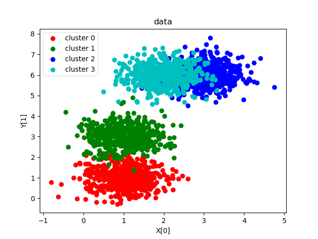

# ML 005 聚类

[TOC]

## 1. 问题描述

### 1.1 数据生成

本次的数据是以指定的三维点为均值点， 依据**高斯分布**生成的。 按照实验报告要求， 生成2000个sample。

取前两个维度作图， 有

### 1.2 要求层次

* 基本要求
  * 实现single-linkage层次聚类算法
  * 实现complete-linkage层次聚类算法
* 中级要求
  * 实现average-linkage层次聚类算法
* 高级要求
  * 对比上述三种算法，给出你的结论。
  * 通过变换聚类簇的个数，测试上述三种算法的性能，并给出你的分析；

## 2. 解决方法

聚类是机器学习“新算法”出现最快的领域， 其一大原因是聚类是无监督的。 即聚类不存在客观的标签作为标准， 而是尝试从数据中发现某种模式。 聚类算法的核心是两点：

* 距离定义
* 聚合方法

因为无监督， 聚类算法的评价标准也不像分类一样清晰明确， 根据我的查询， 聚类算法的评估方式大致有

* 霍普金斯统计

* 聚类质量

我们这次评价聚类， 会使用分类的思路。计算混淆矩阵， 计算precision 、 recall 、 F1 factor。 但只是因为我们的数据是生成的。 我们其实是有标签的。 

## 2.1 距离定义

#### 2.1.1 Item 间距离定义

每个Item实际上是一个特征向量， 说到底是特征向量之间的距离定义。 老生常谈。 我们仅简单列出， 不再赘述实现。 

* Minkowski distance
  * k = 1 Manhattan distance
  * k = 2 Euclidean distence
* 向量夹角距离

#### 2.1.2 cluster 间距离定义

##### 2.1.2.1    Single-linkage clustering

一个类的所有成员到另一个类的所有成员之间的**最短**两点之间的距离

##### 2.1.2.1    Complete-linkage clustering

两个类中**最远**的两个点之间的距离

##### 2.1.2.2     Average-linkage clustering

两个类中的点两两的距离求**平均**

### 2.2 聚合方法

#### 2.2.1 层次聚类

#### 2.2.2 K均值聚类

#### 2.2.3 高斯混合聚类 

## 2.3 聚类效果评估

## 3. 实验分析

### 