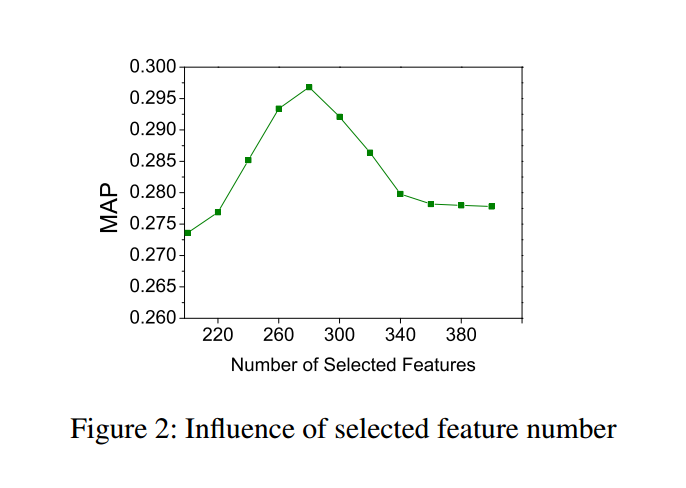
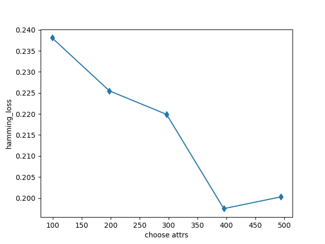
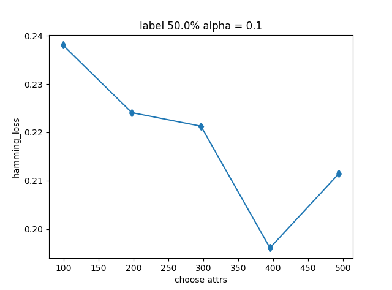
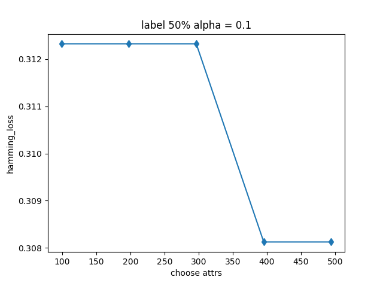
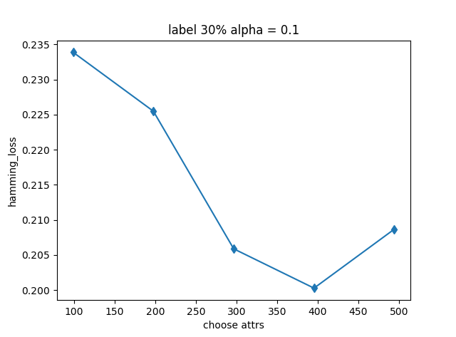
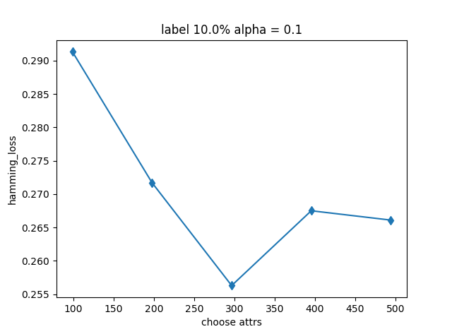
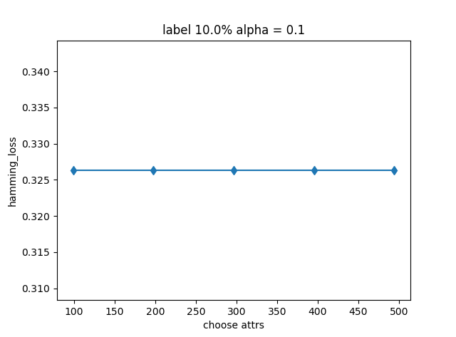
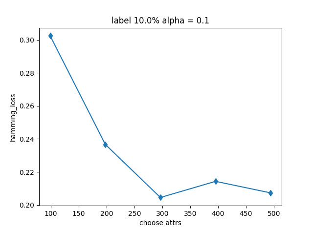

# 作业7 

[TOC]

## 综述

在本次作业中, 我使用python实现了算法. 尝试了算法在有监督, 半监督下的性能, 绘制了特征选择性能曲线.分析了不同半监督场景对特征选择算法的影响.

## 1 问题描述

本次作业主义是理解和实现论文[1]中算法, 在几个数据集下测一测性能

### 1.1 数据描述

emotion数据集, X有593个sample, 每个sample有72维. 每个Y有6个label, label为零表示本sample没有该标签. 反之表示本sample被打上该标签

## 2 解决方法

实际上就是实现paper里的思路.

### 2.1 基础定义

正如Abstract中所说. 本文提出的是一个针对多标签半监督大数据集进行特征选择的方法. 

1. 多标签

多标签是指一个sample具有的特征, 多个标签之间可以有联系也可以没有. 比如一张图片中, 我们使用不同的标签表示是否有桌子\椅子\窗户\门,如果有的话对应标签记为1, 这些标签在图片中出现可以是相互独立也可以不是. 

2. 半监督(Semi-Supervised)定义

本文中定义的多标签下的半监督,  是说数据集中有一部分的sample缺失label, 我们假设这些数据本应该有label, 但是由于一些原因, 比如收集数据集的时候没有时间精力以及财力给所有的数据打label, 而缺失了该有的label.以上文的图片数据为例, 可能并没有财力去标注所有的图片中是否含有各种物件. 

3. 特征选择

需要做出特征选择, 是基于这样的事实:

我们收集的数据中, 一个sample拥有很多特征, 并不是每一个特征都与结果Y那么相关. 也就是说有些特征对预测Y是不起到作用的. 甚而有之, 有些特征可能引入噪音, 降低我们预测的准确率. 具体可以见下图[2]

### 2.2 解决思路

#### 2.2.1 线性回归

使用回归公式作为loss function, 训练X的系数矩阵W, 以W作为矩阵做特征选择.

我们的目标是
$$
min \sum_{i=1}^n loss(f(X_i), f_i) + \mu \Omega(f) \tag1
$$
采用最简单的回归方程作为loss function, 采用矩阵21范数做正则化, 

有
$$
min \sum_{i=1}^n s_i || W^T x_i + b - f_i||_2^2 + \mu || W ||^2_F \tag2
$$
通过矩阵变化和, (2) 式与(3)式子等价
$$
min \sum_{i=1}^{n} Tr(X^TW + \textbf1b^T - F)^T S (X^TW + \textbf1 b^T - F)) +  \mu || W ||_{2,1} \tag{3}
$$
其中, S是一个对角阵,  **1** 是元素为1的列向量.

我们要的是使(3)最小的W, 对(3)求导, 使导数为0, 有
$$
XHSHXT W + \mu DW = XHSHF \tag4
$$
其中D是
$$
D = \left[
 \begin{matrix}
   \frac{1}{2||w^1||_2}  \\
   &... \\
    &  & \frac{1}{2||w^n||_2}
  \end{matrix}
  \right] \tag{5}
$$
D出现是因为我们对21范数求导了. 

由此我们能得到W的递推公式. 
$$
W = (XHSHXT + µD)^{-1}XHSHF \tag6
$$
由此计算出b
$$
b = \frac{1}{m}F^T S \textbf{1} - \frac{1}{m}W^TXS\textbf{1} \tag{7}
$$
循环更新W

#### 2.2.2 半监督应对策略

然后利用新的W和b更新F矩阵(F矩阵的引入是为了解决半监督问题, F矩阵分为有监督和无监督两部分, 无监督的部分需要更新).

因为我们使用的是回归模型, 预测值是连续的, 需要一点小技巧把超过1的和不到0的值做一点处理([3])

差值达到某个阈值以下就可以结束循环. 

#### 2.2.3 特征选择

线性回归收敛的时候, 我们能得到权重矩阵W , W有n行. n为X的特征数量.对于X的一个特征i, W的第i行是该特征的特征向量(来源于WX中他们是相乘的).计算wi的范数, 比较所有行的范数大小, 选出最大的k个, 作为最好的k个特征

## 3 实验分析

使用hamming_loss作为评估,  选取使hamming_loss最小的α. 

### 3.1 有监督场景

各个α值对应的hamming_loss如下表

| α    | 0.00001 | 0.001  | 0.1    | 10     | 1000   | 100000 |
| ---- | ------- | ------ | ------ | ------ | ------ | ------ |
| loss | 0.1946  | 0.1947 | 0.1937 | 0.2212 | 0.2128 | 0.2101 |

因此我们选择0.1作为最好的α, 对应的hamming_loss为0.1937

α=0.1时的特征选择性能曲线.

我们能看见曲线先下降后上升. 曲线下降是因为我们还没有选择到足够的特征, 上升是因为我们引入了其他噪音. 
这个特征选择曲线是比较标准的特征选择曲线. 和2.1节中论文[1]中的特征选择性能曲线传达的信息一致.

### 3.2 50% label 的半监督场景

考虑的是训练集中有百分之五十的sample失去了所有标签.

我们的模型之所以能应付这个情况, 是因为模型中每次都使用迭代出来的F矩阵更新Y, 即把预测出来的Y值作为缺失label的sample的label使用. 

在这样的情况下, 我们依然使用α=0.1, 去除百分之五十的标签,得到的hamming_loss为0.1962, 相比完全有监督的场景, hamming_loss仅仅增加了0.0025

可以说算法效果极其好

特征选择曲线

我想要知道, 使用预测的Y代替真的Y值这个策略对最终的hamming_loss起到了多大的作用. 

于是, 我取消了训练函数中使用预测的Y代替真的Y值这个策略, 在同样的数据, 同样的α取值下, 计算的hamming_loss 急剧上升, 为0.3085.

特征选择曲线

### 3.3 30% label 的半监督场景

考虑的情况和3.2节相同

在这样的情况下, 我们依然使用α=0.1, 去除百分之七十的标签,得到的hamming_loss为0.2004, 相比完全有监督的场景, 效果比50%的稍微差一点点, 差了0.0040.

特征选择曲线

测试不更新Y的情况, hamming_loss为0.3263

特征选择曲线

### 3.4 10% label的半监督场景

考虑的情况和3.2节相同

在这样的情况下, 我们依然使用α=0.1, 去除百分之九十的标签,得到的hamming_loss为0.2564, 相比完全有监督的场景, 效果比30%的差不少, 差了0.0560.

特征选择曲线

假设没有更新环节, 直接扔到SVM里, hamming_loss = 0.3263

特征选择曲线

可以看见, 在这个情况下其实已经完全无法去做特征选择了. 

### 3.5 不同半监督场景对特征选择算法的影响

两个结论:

1. 半监督下算法之所以表现良好, 是因为使用预测出的Y更新无标签的samples.

   在标签留存百分之50的时候, 不更新的算法还能起到一定的特征选择的作用, (见3.2节图),

   但是标签留存百分之三十和以下, 不更新就完全不能进行特征选择了, 这个时候的hamming_loss就是单纯缺失label的Y放进SVM里产出的

2. 半监督下, label留存得越少, 模型的预测能力越差.但是**特征选择的能力并没有大幅变差**.
  预测能力差表现在hamming_loss随着label的减少而增加. 但是这并不一定是因为选择矩阵不好, 不能选出更好的attribute.更大的可能是因为扔进SVM里的数据里真的变得越少(使用预测代替的变多).
  对于这个结论, 可以设计实验, 只使用减少label后的数据做特征选择, 放进SVM里的数据仍然是完整的数据, 如果使用这样的策略, 得到的情况是:

| 留存label | 预测Y放进SVM | 预测Y不放进SVM |
| --------- | ------------ | -------------- |
| 100%      | 0.1937       | 0.1937         |
| 50%       | 0.1962       | 0.1960         |
| 30%       | 0.2002       | 0.1988         |
| 10%       | 0.2564       | 0.2044         |

可以看见， hamming_loss 随着 留存label 比例下降而快速上升， 主要是有因为我们放进SVM里的Y矩阵并不真实， 如果采用真实的Y矩阵， 其实模型选择attribute的能力并不随着留存label的比例下降而大幅度下降。（当然不可避免的还是有下降比如说某种attribute的所有sample都没有label那就没办法分辨了）。

一张特征选择图片， 对应 留存label = 10% ， 但是放进SVM的Y是真实数据。（也就是说， 缺失label补全的行为只用来做特征选择， 并没有给SVM提供信息）

